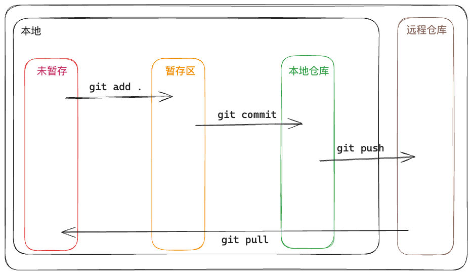

# Git 简易指南

常用命令：

- 查看状态

  ```shell
  git status
  ```

  
  
- 暂存：将文件从「未暂存区」转移至「暂存区」

  ```shell
  git add .
  ```

- 提交

  ```shell
  git commit -m 
  ```

- 推送

  ```shell
  git push
  ```

- 拉取

  ```shell
  git pull
  ```

- 克隆

  ```shell
  git clone
  ```

  
