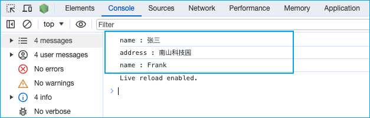

JSON 的妙用

```js
// 定义变量  
var tempObj = {
  name: '张三',
  age: 20,
  address: '南山科技园',
  friend: {
    name: 'Frank',
    age: 22
  },
}
// 函数
function fn(obj) {
  return JSON.parse(JSON.stringify(obj, (key, val) => {
    if(typeof val === 'string') {
      console.log(key, ':' ,val)
      return val
    }
    return val
  }))
}
// 调用
fn(tempObj)
```

效果：


